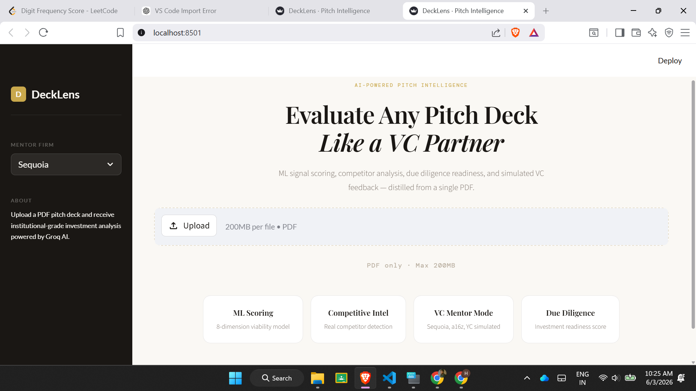
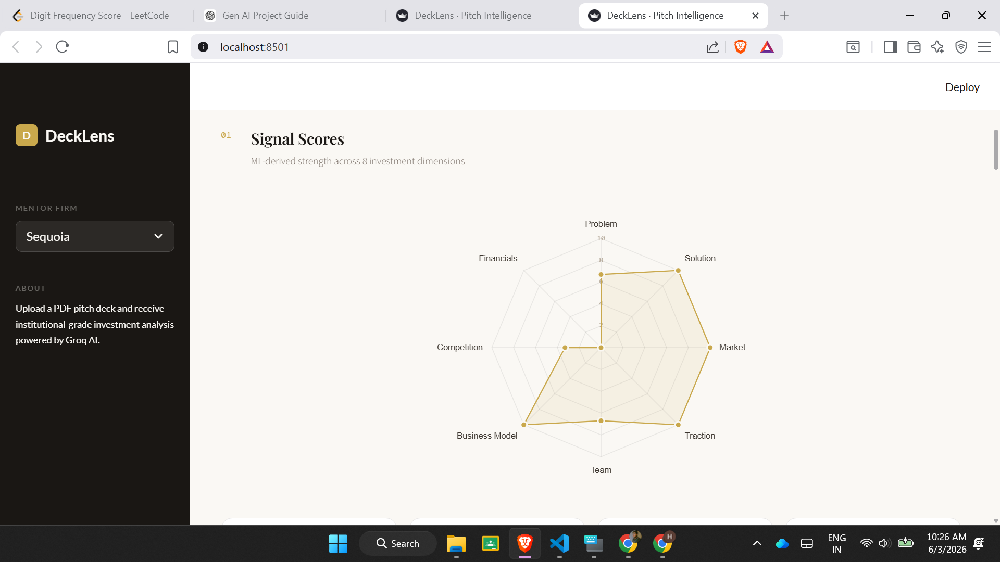
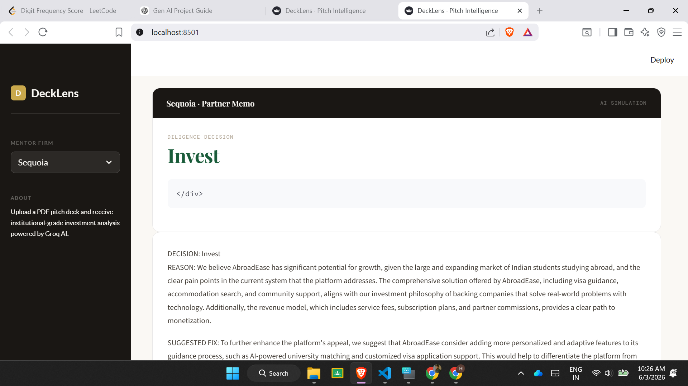

# DeckLens

AI-Powered Startup Pitch Deck Analyzer

## Features

- Investment Readiness Scoring
- Competitor Discovery
- Due Diligence Analysis
- Risk Assessment
- Investment Thesis Generation
- VC Mentor Feedback
- Final Investment Verdict

## Tech Stack

- Python
- Streamlit
- Groq
- Machine Learning
- PDF Processing

## Screenshots

## Installation

pip install -r requirements.txt

streamlit run app.py